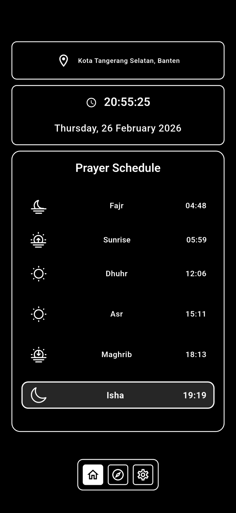
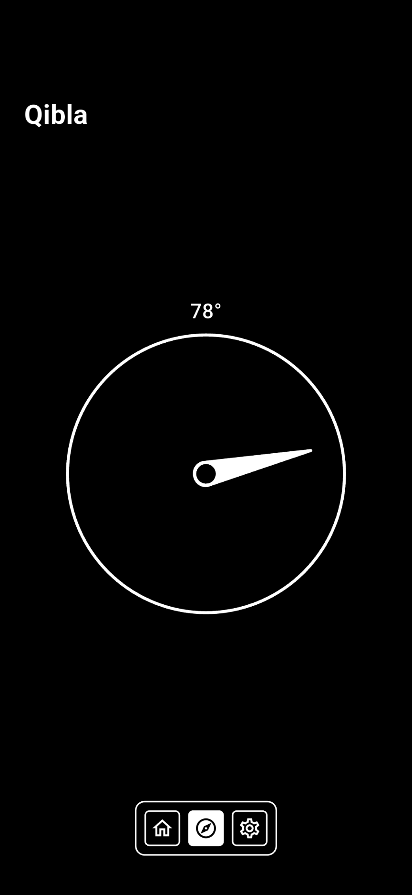

<div align="center">
  <!-- Replace the URL with your app icon/logo path if available -->
  

  # Solat App

  **A real-time prayer reminder and accurate prayer schedule app based on the user's location.**

  [](https://flutter.dev)
  [](https://dart.dev)
  [](https://pub.dev/packages/get)

</div>

---

## 🌟 Key Features

- 📍 **Automatic Location Detection**  
  Retrieves accurate prayer times (Fajr, Sunrise, Dhuhr, Asr, Maghrib, Isha) by adjusting to the device's GPS coordinates.

- 🕋 **High Accuracy**  
  Directly integrated with trusted data from the Aladhan API.

- 🔔 **Notification & Overlay Widget**  
  Smart reminders (Native Alarm & Push Notifications) when prayer time begins.

- ⚡ **Fast & Lightweight**  
  Built using **GetX State Management** for seamless UI state transitions without lag.

---

## 📦 Download APK

You can download and install the Android application directly from the Google Drive link below:

👉 **[Download Solat App (APK)](https://drive.google.com/drive/folders/1kKgQwffShvFP57T50BWBlV82uJ5u4aR5?usp=drive_link)**

---

## 📸 App Screenshots

<p align="center">
  
  
</p>

---

## 🛠️ Technologies & Libraries

This project uses several powerful libraries to ensure optimal performance:

- **GetX** – Routing, State Management, & Dependency Injection  
- **Geolocator & Geocoding** – Convert coordinates into city names (Reverse Geocoding)  
- **Awesome Notifications** – Background & Foreground notification configuration  
- **HTTP/REST** – Server communication and API integration  

---

<div align="center"> <b>Built with ❤️ to make worship easier</b> </div> ```
